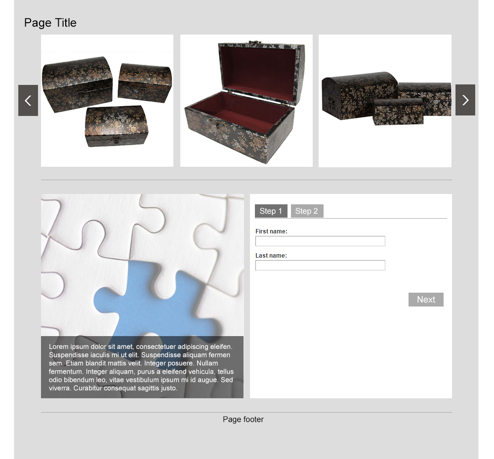

# exercise instructions.

<b>How it should look like</b>

Please build a web page as per supplied mock-up and other images. When done the web page must be identical to the mock up (no additional or missing elements, identical colours, identical alignment of elements etc.)

**Additional information:**

Form on the page should be completed by users in two steps. Clicking "Next" will show the next step with fields "Telephone Number" and "Email Address". Clicking next on Step 2 part of the form should submit it.

**Requirements:**
1. Page should be built as fluid and responsive supporting screen widths from 320 to 1100 pixels.
2. Box carousel slideshow should be built using Swiper component from www.idangero.us/swiper.
3. The page should work correctly with different amount of content (various number of slides, various amount of "Lorem ipsum" text).
4. On smallest screen it is expected that the slideshow will display only one item at a time and the form will be below the puzzle block.
5. Find a use for one CSS3 transition.
6. The only allowed 3-rd party code libraries are jQuery and Swiper. (no bootstrap, formwizards, etc.)

